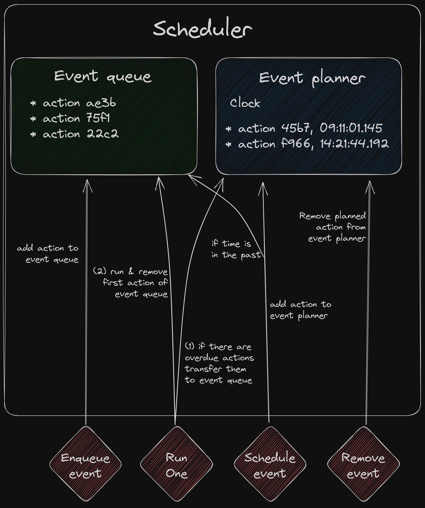

# Single Threaded Kademlia Design

Author: [Guillaume Michel](https://github.com/guillaumemichel)

## Design overview & rationale

This DHT implementation allows a sequential execution, providing many benefits (such as stable testing, better debuggability, reproducible simulations, etc.). The Kademlia query process is most efficient when multiple requests are sent concurrently. In order to reach both sequential execution and concurrency, this implementation follows a same thread concurrency pattern. As much work as possible will be carried out by the single worker.

In some cases, it is required that the implementation deals with multiple threads. For instance, callers may call this implementation from multiple threads. Some message endpoint implementations (such as [`libp2p`](../network/endpoint/libp2pendpoint/)), need to have a dedicated thread for sending a request and receiving an answer.

In order to orchestrate the process, this implementation includes a [`scheduler`](../events/scheduler/), responsible for synchronizing the necessary threads with the single worker. The scheduler offer a thread safe interface to add [`actions`](../events/action/) to the event queue of the single worker to be run as soon as possible, or to schedule an action at a specific time. The actions are simply pointers on functions that are executed when the single worker picks them up.

### Query process

For example, when a caller wants to perform a lookup request over libp2p, it will add an action to the scheduler to create a query for specific parameters (e.g `FIND_PEER` and target `peer.ID`). Once available, the single worker will create the associated request, and depending on the concurrency of this request, add `concurrency` `SendRequest` `actions` to the event queue.

It will then execute the `SendRequest` `actions` one by one. The `SendRequest` action consists in looking up for the closest known peer to the target Kademlia key that hasn't been queried yet, and send it a request over libp2p. As [go-libp2p](https://github.com/libp2p/go-libp2p) needs a dedicated go routine to send a receive message, the single worker creates a new go routine that will handle the network part. The single worker can then pick up the next action in the event queue.

The libp2p message go routine, will (1) dial the remote peer, (2) send the IPFS Kademlia request, (3) schedule a timeout `action` to the `scheduler`, after the provided timeout value and (4) wait for an answer. If there is an error during this process, the go routine will add an error `action` in the event queue and die. If the go routine receives an answer before the timeout happens, it will add a `HandleResponse` event to the event queue, that will be picked up by the single worker once available, it will remove the scheduled timeout event and then the libp2p message go routine can die in peace. If the libp2p go routine receives a message after the timeout, it can also die in peace.

If the timeout even is picked up by the single worker, it means that the remote peer has failed to answer on time. The single worker will update the query, and enqueue another `SendRequest` `action`.

When a `HandleResponse` `action` is picked up by the single worker, it executes the `ResponseHandlerFn` (`func(context.Context, kad.NodeID, message.MinKadResponseMessage) (bool, []kad.NodeID)`) that was provided by the caller when creating the query. This function should return whether the query should terminate, and the list of useful peers to query next. Hence, the caller can keep a state for the query, and decide when it should terminate. If the query shouldn't terminate yet, the single worker updates the query state, and enqueues another `SendRequest` `action`.

This makes the execution as sequential as possible, given that it depends on the network and remote peers.

### Tests & Simulations

It is also possible to run a single threaded simulation, for instance to perform tests. The single threaded simulation is strictly sequential, and can be controlled by the programmer. A [`simulation`](../events/simulator/) usually uses a [`fake message endpoint`](../network/endpoint/fakeendpoint/) to disptach messages from one simulated host to another. The simulation can for instance, continuously run one action in each node's scheduler, in a specific order, until they are no more actions to run. This allows accurate testing of the modules.

### Keys & Addressing

A [`Kademlia key`](../key/) is simply an slice of bytes of arbitrary length that can be defined by the user. The logic to build Kademlia keys from libp2p `peer.ID` is described in this [module](../key/sha256key256/).

Node [`addressing`](../network/address/) is as generic as possible to enable multiple DHT implementations to build on top of this library. A `NodeID` should only implement a `Key()` function, mapping to its Kademlia key. 

### Modules

This repository is composed of modules that can easily be exchanged. For instance, the IPFS DHT implementation will not use all the same modules as a DHT simulation, even though they follow the same logic. Most of the code is reused, and only the addressing, networking part, event loop need to be changed. Another example is that it is very easy for a custom DHT implementation to change it routing table logic, while still taking part in the same DHT network.

## IPFS DHT Interface

### Peer Routing

- `FindPeers([]peer.ID) []peer.AddrInfo`: returns the `[]peer.AddrInfo` associated with the requested `[]peer.ID`
- (`GetClosestPeers(key, n) []peer.AddrInfo`): find the n closest `peer.ID` to the fiven `key` and return their associated `peer.AddrInfo`

Note that these functions can be sync or async. If they are sync, they block until we get the full result. If async, they return `peer.AddrInfo` as they are discovered.

Note that the `FindPeers` will be called with a single `peer.ID` in most of the cases.

### Provider Records

**Provide**
- `StartProvide([]cid.Cid)`: start providing the given CIDs, and keep republishing them
- `StopProvide([]cid.Cid)`: stop republishing the given CIDs (if they were provided)
- `ListProvide() []cid.Cid`: returns the list of CIDs being republished

**Lookup**

- `FindProviders([]cid.Cid) []peer.AddrInfo`: looks for the provider records associated with the requested `[]cid.Cid`, and return the `peer.AddrInfo` of the peers providing it.

Note that this function can be sync or async. If sync, it blocks until we get the full result. If async, it returns provider records as they are discovered.

Note that the `FindProviders` will be called with a single `cid.Cid` in most of the cases.

### IPNS

- `PutValues([]key, []value)`: for all key-value pairs, store `value` in the DHT at the location `key`.
- `GetValues([]key) []value`: for each `key`, retrieve the associated `value` and return it

### Others

- (`GetPublicKey(PeerID)` ??): this RPC should be dropped.
