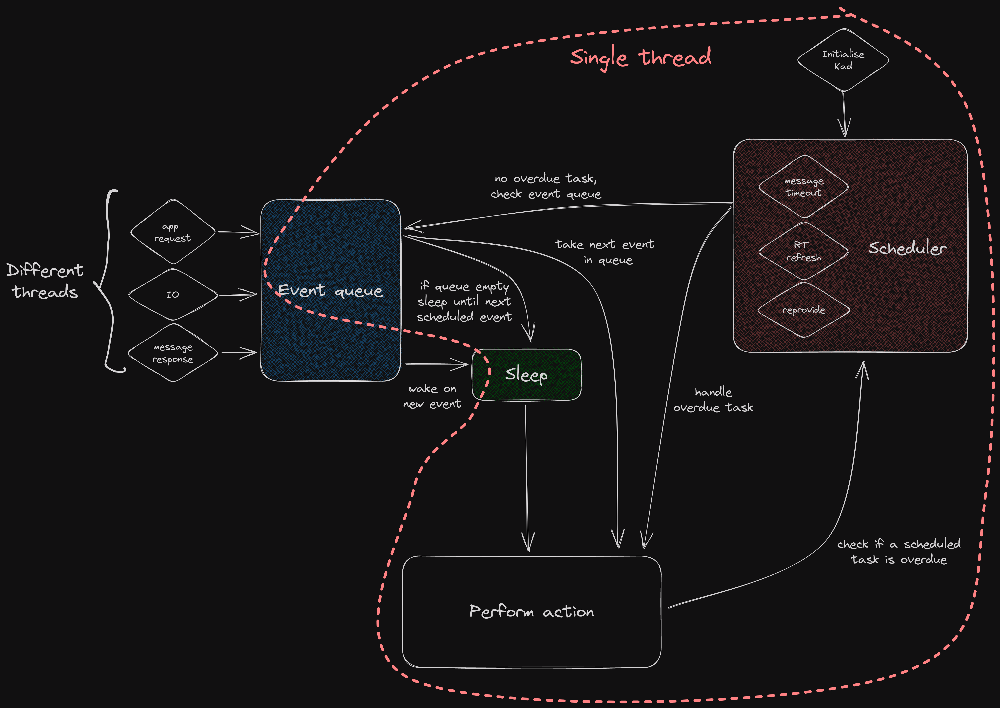
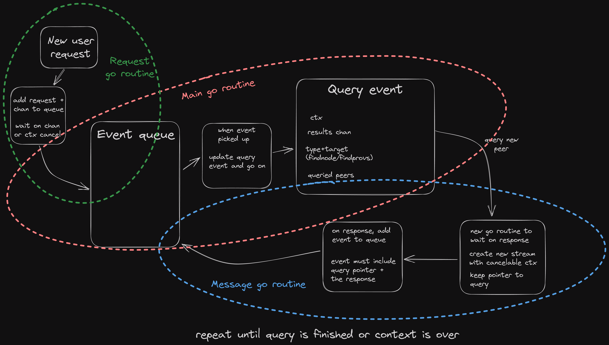
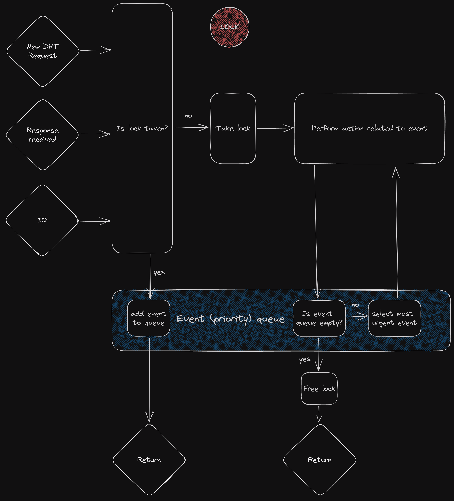
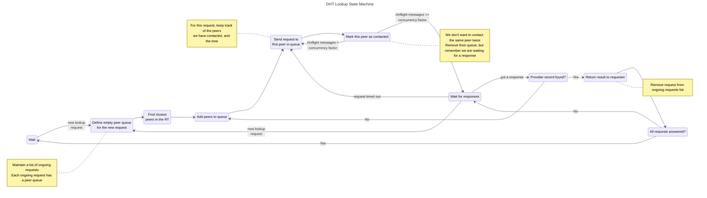
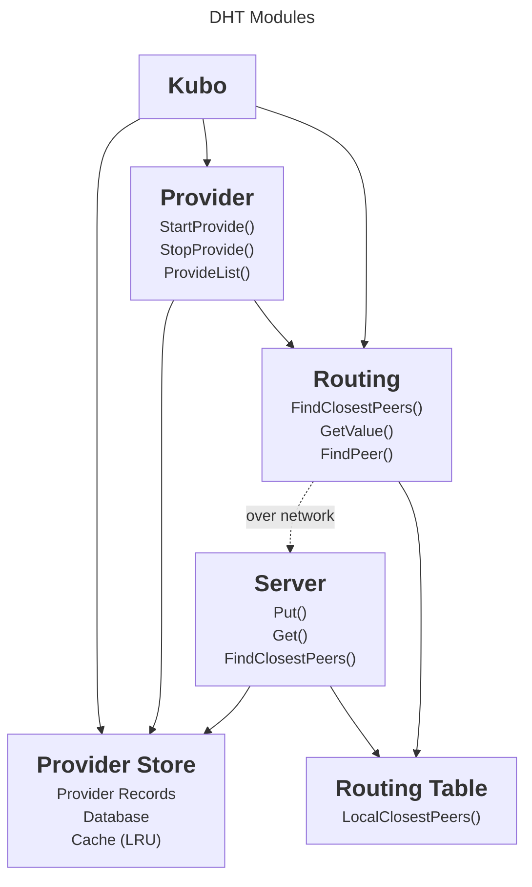

# Single Threaded Kademlia Design

Author: [Guillaume Michel](https://github.com/guillaumemichel)

## DHT Interface

### Peer Routing

- `FindPeers(PeerIDs)`
- (`GetClosestPeers(key)`)

### Provider Records

**Provide**
- `StartProvide(CIDs)`
- `StopProvide(CIDs)`
- `ListProvide()`

**Lookup**
- `FindProvidersAsync(CID)`
- `FindProviders(CID)`

### IPNS

- `PutValues(keys, values)`
- `GetValues(keys)`

### Others

- (`GetPublicKey(PeerID)` ??)

## State Machines

### Event Loop

### Query Process

### Single Thread Non Blocking High Level State Machine

Even though the Kademlia implementation is single threaded, its callers may not be single threaded. Moreover, in the go-libp2p implementation, when a request is sent (by the Kademlia implementation) a new go routine is created and waits for a reply. Hence, it will be a go routine that resumes execution after a response is received. It may necessary to resume execution for IO, because Provider Records may be stored in blocking databases. The goal is to have at most one thread doing Kademlia operations at a time.

For this reason, as multiple event may occur _simultanesouly_ (from multiple go routines), if Kademlia is already running, we need to have a priority queue for events.

### State that we need to keep track of

### First attempt at DHT Lookup State Machine

## Modules

Major modules of the DHT. Additional modules can be added.

I.e `fullrt` only has a different `Routing Table` implementation (allowing to bypass some `Routing`).

### Provider Store

`Provider Store` is responsible for storing and serving provider records, either pinned locally or remotely. It defines a specific `Provider Record` format. The design of the `Provider Store` database is left to the module implementer.

**Interface**

Above:
- `PUT(key, value)`
- `GET(key) value`

Below:
- Database scheme?

### Provider

`Provider` is responsible for providing and reproviding content pinned through its interface (`StartProvide` and `StopProvide`). It writes pinned content to the `Provider Store`, and makes use of `Routing` to find the appropriate peers to allocate the provider records.

**Interface**

Above:
- `StartProviding([]cid.Cid)`
- `StopProviding([]cid.Cid)`
- `ListProviding() []cid.Cid`

Below:
- Provider Store (to store pinned CIDs, and access the reprovide list)
- Routing (to advertise pinned CIDs)

### Routing Table

`Routing Table` is a database of peer identities and multiaddresses. It must expose at least a `LocalClosestPeers` function returning the closest peers in XOR distance to a provided key. `Routing Table` is responsible for deciding how many peers, and which peers are recorded.

**Interface**

Above:
- `TryAddPeer(peer.AddrInfo) bool` try to add a peer in the routing table
- `RemovePeer(peer.id) bool` remove a peer from the routing table
- `GetClosestPeers(KadId, n) []peer.id` finds the `n` closest peers from the Routing Table (local)

Below:
- add peers to libp2p peerstore (with specific TTL, and keep peers in peerstore even tough we may not be connected anymore)
- remove peers from libp2p peerstore

Note: need to check whether these operations are blocking.
### Routing

`Routing` is a large module, responsible for finding remote peers or values in the network. It needs `Routing Table` to keep track about the identity and multiaddresses of remote peers. `Routing` performs the iterative DHT query process.

**Interface**

Above:
- `FindClosestPeers(KadId, n) []peer.id` finds the `n` closest peers globally
- `FindProviders(KadId)` lookup stops once a matching provider record is found
- `FindValue(KadId)` essentially the same as `FindProviders(KadId)`

Below:
- Routing Table
- Server

### Server

`Server` is responsible for handling incoming requests. For `Put` and `Get` requests it must write to and read from the `Provider Store`. For `FindClosestPeers` requests, it needs the `Routing Table`'s `LocalClosestPeers` function. Actions in `Server` are usually triggered by the `Routing` modules from another peer across the network.

**Interface**

Above (remote nodes requests):
- `Put/Provide(KadId, val)`
- `Get/GetProviders(KadId)`
- `FindClosestPeers(KadId)`

Below:
- Routing Table (`GetClosestPeers(KadId, n)`)
- Provider Store (for content PUT/GET requests)

### Network

Use proto3 instead of custom data format.
Use r := pbio.NewDelimitedReader(s, signedIDSize), as reader and similar writer.
Use sync.Pool to avoid too much allocations.

### Modularity

Ideally no module should depend on a specific peer addressing (e.g peer.ID). All modules should support generic network addressing.