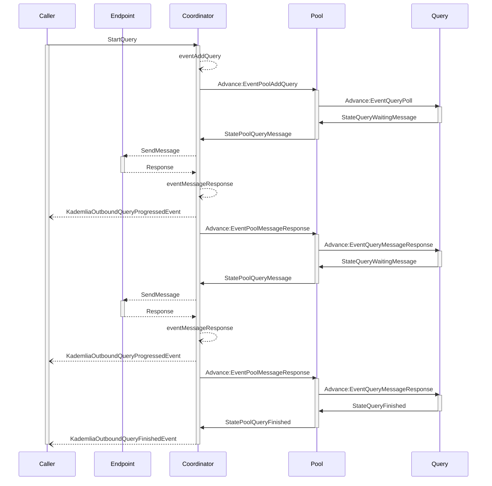
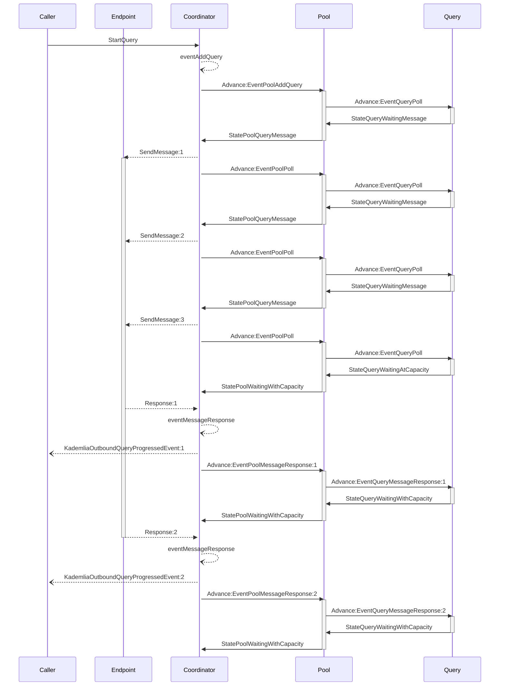
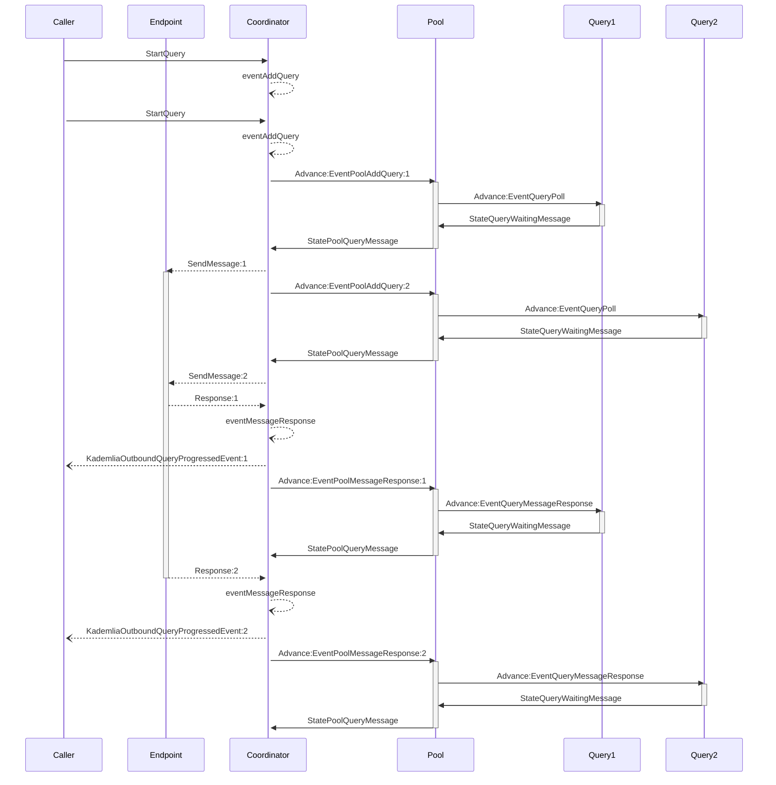

# State Machine Rationale and Design

Author: [Ian Davis](https://github.com/iand)

Last Updated: 2023-07-31

This document descriibes the design and rationale of the state machine approach to implementing the Kademlia protocol.

## Rationale

The main non-functional design goal of this new Kademlia implementation is to create a more predictable, maintainable and testable codebase that can provide an extensible platform for new DHT capabilities. As OSS it is important that new contributors are attracted to the project so ease of understanding, straightforward debugging and consistency of design are also high priority.

The hierarchical state machine approach addresses these goals in the following ways:

 - **Determinism** - The state machine follows a deterministic flow, meaning that given a particular input or set of conditions, it will always produce the same output. This predictability makes it easier to isolate and reproduce issues, as bugs are more likely to occur consistently within specific states or transitions. The events in the state machines can be linearised, in the sense that the same sequence of events will produce the same sequence of state transitions, regardless of the timing of event arrival. When combined with a determistic clock implementation this enables accurate simulation of time-dependent behaviours, such as timeouts.

 - **Transparency** - Each state in the machine is assigned a specific responsibility, focusing in on a particular aspect of the protocol's behaviour. This focused scope narrows down the search for potential problems to specific areas of the codebase, reducing the debugging space and making it more manageable. The states are represented as simple data values that can be easily inspected or logged which provides developers with clear visibility into the state transitions and the current state of the protocol during its execution. Developers can track the sequence of events leading to an issue, enabling them to identify root causes and simplifying resolution.

 - **Testability** - The state machines can be unit tested by testing each state and transition separately. This approach helps ensure that each component functions correctly, leading to a more reliable and robust protocol implementation. When debugging a specific state, developers can isolate that state's context, ignoring the complexities of other parts of the code. This isolation allows for focused testing and simplifies the understanding of how individual states contribute to the overall behavior. A state machine can be placed in a specific initial state and tested for expected behaviour under various valid and invalid inputs.

 - **Extensibility** - A state machine is inherently easier to extend due to its modular and hierarchical structure. Each state in the machine represents a specific behaviour or functionality, making it simpler to add new states and transitions to accommodate additional features or enhancements. The clear separation of concerns, where each state focuses on a specific aspect of the software's behaviour, makes it easier to identify the appropriate location for incorporating new features, reducing the risk of unintended interactions with existing states.

- **Consistency and Understandability** - The hierarchical nature of the state machines promotes readability and understandability of the code. New states are logically integrated into the existing structure, making it easier for developers to comprehend the software's behaviour as a whole. The transitions between states can be drawn to help visualise behaviours. The consistent use of the state machine pattern across components ensures uniformity in behavior and interface, allowing developers to understand the system more quickly and reducing ambiguity.

In addition, the state machine model enforces a structured and controlled execution flow, making it easier to impose limits on resource consumption:

 - **Memory** - As the state machines transition between states they can release memory allocated for states that are no longer active.
 - **Concurrency** - The state machines provide bounds on concurrency, offering full control over the number of in-flight operations. 
 - **CPU** - The finite number of states and combinations ensure that the work to be undertaken is bounded and known ahead of time.
 - **Network** - Network connections are opened, closed, and reused appropriately based on the state transitions. This controlled socket management can help prevent leaks or exhaustion, leading to more efficient utilization of network resources.

## Components

### The Coordinator (`coord` package)

Kademlia is inherently an asynchronous protocol dependent on variability of network latency and responsiveness of peers.
We shouldn't hide this complexity from users of go-libdht but we can confine its API surface.

The `Coordinator` plays this role. Users of the `Coordinator` subscribe to a channel of Kademlia events to receive notificationof the progress of queries as well as other things including updates to routing tables. 
Users call methods on the Coordinator to initiate operations such a starting a query. They receive an error response immediately if the operation could not be started, perhaps due to invalid arguments passed by the caller. Otherwise, if no error is returned, the caller must wait for events on the channel to monitor the outcome of their request.

A pattern for using this is in the `statemachine` example. The `IpfsDht` type in that example implements a
synchronous `FindNode` method that starts a query via the coordinator and then monitors the event channel
for updates as the query progresses, until it finally completes.

### The Pool and Query state machines (`query` package)

Queries are operated via two state machines organised hierarchically. The query `Pool` state machine manages the lifetimes of
any number of `Query` state machines. Each user-submitted query is added to the `Pool` and is executed by a
dedicated `Query`. 

The `Query` state machine manages the lifecycle of the query, traversing nodes according to an iteration strategy. 
By default this is `ClosestNodesIter` which maintains a dynamic list of nodes and their connection status, sorted by ascending distance to the target of the query. The query is configured with a message to be delivered successfuully to a threshold number of nodes, typically 20.

The query proceeds by iterating through the list, attempting to communicate with the first uncontacted node in the iterator, which in the default case is the next closest node to the target. 
The query signals this by entering the `waiting to send message` state. The query marks the node as waiting for a response.

When polled to advance to the next state the query will pick the next node in the iterator and enter the `waiting to send message` state for this node, repeating with each poll until it reaches a configured concurrency limit. At that point it enters the `waiting at capacity` state, indicating that it will not issue any further message requests until capacity is available.

Receiving a response from a node may free up capacity, causing the query to proceed to the next node or, if no uncontacted nodes remain, enter the `waiting with capacity` state.
Responses received from nodes may contain additional closer node candidates which the query will add to the iterator for possible traversal.
The query enters the `finished` state when it has received successful responses from at least the threshold number of nodes, in iteration order, or has run out of nodes to contact.

Resources are bounded by limiting the number of concurrent queries that can be running and the number of concurrent messages that can be in-flight for each query.  Capacity is freed when an in-flight message receives a successful response, a communication failure or reaches an inactivity deadline. The `Pool` prioritises work for queries that are making progress.

## Operation

### Simple Query

The following diagram shows the sequence of operations involved in performaing a simple query. It illustrates the separation of responsibilities between the Coordinator, the Pool and Query state machines and the Endpoint. 

Asynchronous operations are shown as dotted lines with open arrows. Notably the `Coordinator` turns synchronous calls such as `StartQuery` into asynchronous events (`eventAddQuery` in this case) which are then queued and processed internally in the sequence they were received. Requests to the `Endpoint` are made asynchronously and responses are added to the internal queue.

Interactions with the `Pool` and `Query` state machines are synchronous and deterministic.

### Query with higher request concurrency

The following diagram illustrates the interactions with a query `Pool` that allows several concurrent queries. Queries are limited to a request concurrency of 3.

The `Caller` starts a query which is added to the `Pool` state machine, creating a new `Query`. The `Query` state machine requests to send a message to the first node in its iterator by entering a state of `waiting for a message`. This is conveyed by the `Pool` to the `Coordinator` which instructs the `Endpoint` to send the message. 

The `Coordinator` then polls the `Pool` to determine if it can proceed with work. The `Pool` polls the `Query` which has not reached request capacity so can issue a new request. It responding by entering the `waiting for a message` state which contains the next node that the query needs to contact.

This is repeated, with the `Query` requesting to send a third message. It has now reached its configured request concurrency so on the next poll by the `Pool` it enters the state `waiting at capacity` to signal that it cannot progress until responses are received (or deadlines are reached). 

Since the `Pool` has capacity to manage more than one query it enters the state `waiting with capacity`.

As responses are received, and assuming no further closer nodes are discovered, the `Query` enters the state of `waiting with capacity`, indicating that it could start more work if new nodes were found.

### Two concurrent queries

The following diagram shows the interactions involved when two queries are started. The `Caller` should expect to receive progress events from the `Coordinator` for both queries. These events may be interleaved depending on the order in which responses are received from the network.

